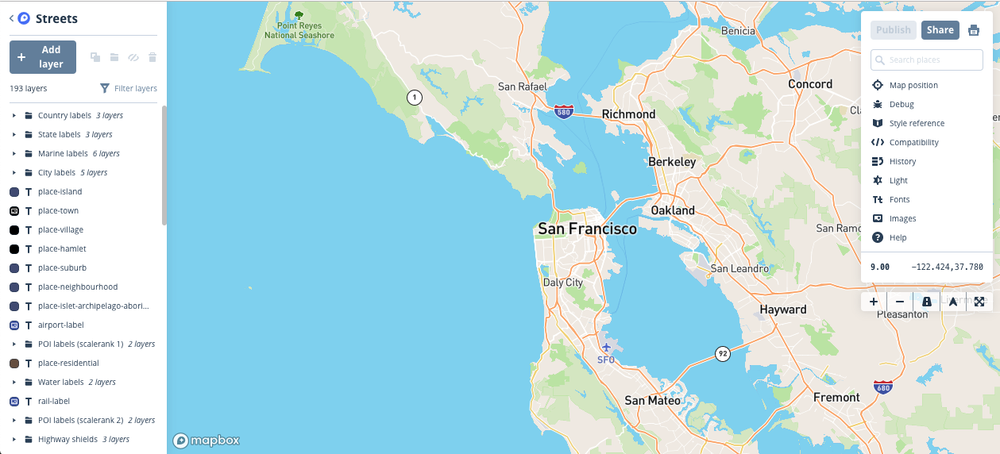
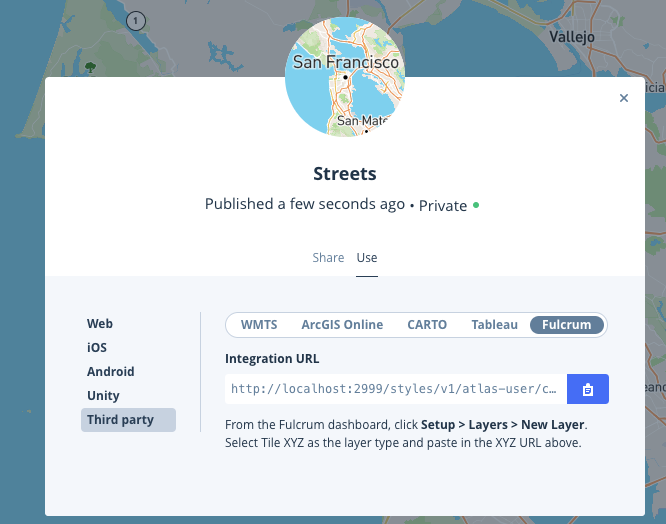
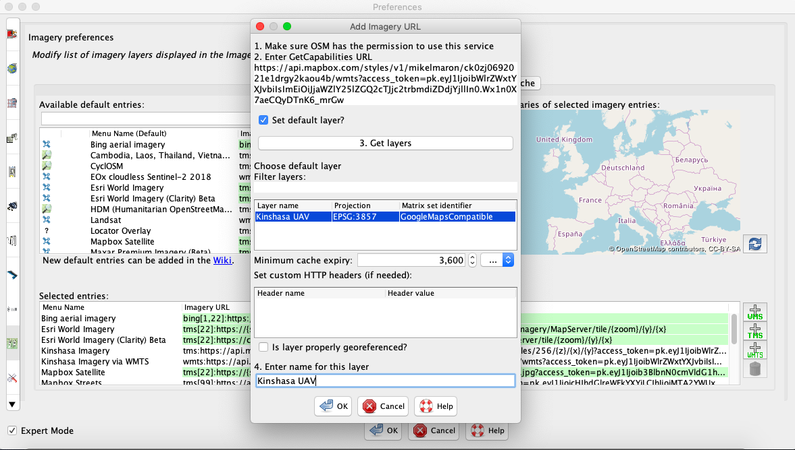

## Digitize Imagery in JOSM

### Goal

Configure JOSM to load an aerial imagery style hosted on Atlas

### Requirements

An imagery style built in Atlas

### Instructions

First, get the `WTMS` integration endpoint for the style.

From the style editor, click "Share", then switch to the "Use" tab.

In the Share dialog, click `Third Party`, and then `WMTS`. Copy the `Integration URL`.

Now in JOSM, open the `Imagery Preferences` panel in `Preferences`. In the bottom right click the `WTMS` button.
* Paste the integration URL below `2. Enter Get Capabilities URL`.
* Select `Set default layer?`
* Click `3. Get layers`
* Below `Choose default layer`, only one layer will load. Select it.
* Below `4. Enter name for this layer`, give the layer a memorable name.
* Click `Ok`

Now you can use this imagery hosted on the Atlas Fly Away Kit for editing. The Fly Away Kit may not be connected to the internet. So to download and upload OSM data, connect your laptop to another access point for data transfer. Then reconnect to the WIFI for the Fly Away Kit.

Happy Editing!
