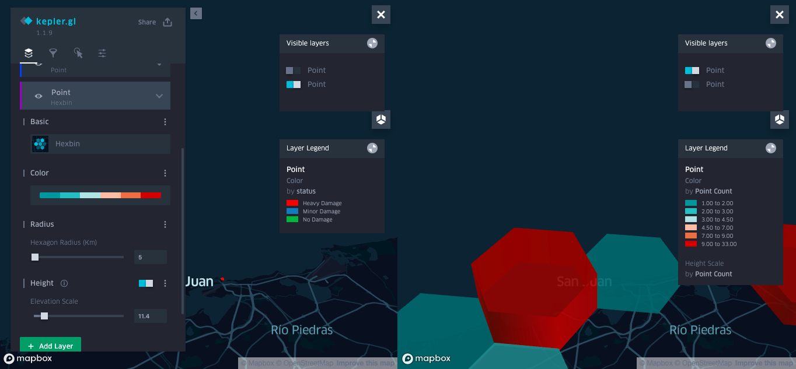

## Visualize Data in Kepler

### Goal

Build and share two different custom interactive visualizations in Kepler

### Requirements

Kepler works mainly on CSV data. For this lesson, we use [Damage assessment data collected in Fulcrum after Hurricane Maria](
http://192.168.1.100:TBD/damage.csv) and [hands on assessment data just collected] (A copy of the damage assessment CSV file is available here at [data/damage.csv](./data/damage.csv).)

### Instructions

#### Launch Kepler with your data
Kepler.gl is a powerful and easy to use open source geospatial analysis tool for large-scale data sets. There is a link to open Kepler on the main page of Atlas, or directly at http://192.168.1.100:2999/kepler.gl

First, you will be prompted to load data. Click "Load Map Using URL" and enter `http://192.168.1.100:TBD/damage.csv`

#### Points visualization

Kepler will immediately create a simple Point visualization with the data set.

(Kepler will also create a Polygon layer. Remove that layer by clicking the trash icon on that layer bar.)

Open the "Points" visualization panel, click the color box under "Fill Color", and select another color for the points.

Open additional color options by clicking the "..." to the right of "Fill Color". Then click the box below "Color Based On", and select "structure_usable". Then click on the color bar, and set "Steps" to 3. Then select "Custom Palette", click the third item, and select a shade of Green. Click "Confirm". This apples a palette with red for unusable structures, green for usable.

Next apply a filter. Click the "Filters" panel, then "+ Add Filter". Click "Select a field", and select "number_of_stories". Adjust the range below to filter out 1 story buildings.

Finally, adjust what fields are displayed when hovering over a point. Click the "Interactions" panel, and "x" off all the fields present. Click elsewhere in the box and select "created_by", "general_notes", "year_built" and "roof_shape".

#### Hexbin visualization

Before creating the second visualization, return to the "Filters" panel, and delete the filter.

Go back to the "Layers" panel, and under "Basic", click the visualization type dialog, and select "Hexbin". Also click the name of the Layer, and rename it from "Point" to "Hexbin". Hexbin will aggregate all points within a hexagonal tile.

Change the "Radius" to 5, and "x" out the "Color based on" selection so that it is "Point Count". Click the palette, and change "Steps" to 6, and select another one. The brighter the color, the more incidents occurred in that hexbin.

To create a 3D view of the hexbins, select "3D Map" on the upper right side, and also "Show Legend". Enable "Height" in the "Layers" panel, and adjust "Elevation Scale" to 30.

#### Add data from today

In the "Layers" panel, click "+ Add Data". Click "Load Map Using URL" and enter `http://192.168.1.100:TBD/nethope.csv`.

Delete the "Polygon" layer, and hide the "Hexbin" layer for the moment. Disable "3D Map" and zoom in on the hotel. Customize the colors (try basing on "Status") and the interaction. Un-hide the "Hexbin" layer.

Now enable "Switch to dual map view" with the button in the upper right. Click the layers button in the upper right of each panel to "Show layer panel" and choose which layers are visible in each panel. Select "Hexbin" in one and "Point" in another, to explore both views at once.

#### Change the base map

In the left hand panel, click the "Base map" tab, and click "+ Add Map Style". In another tab, find the style you created from the [Studio Styles page](http://192.168.1.100:2999/studio/), and click "Share & Use". Switch to the "Use" tab and copy the access token, and then the style URL. Paste these into the "Add Custom Mapbox Style" dialog in Kepler.

#### Finalize and share the visualization

Finally click "Share", then "Export Map". Make sure "json" is selected for the "Map format", then click "Export". This will trigger a download of "keplergl.json".

This file contains both the data and styling to recreate the visualization. You can share this json file with a colleague by email or flash disk, and they can upload to kepler to see your visualization.

To test this, reload your browser, and you will see the original "Add Data to Map" dialog. Find the json file you downloaded, and upload. Your visualization will be recreated entirely.
