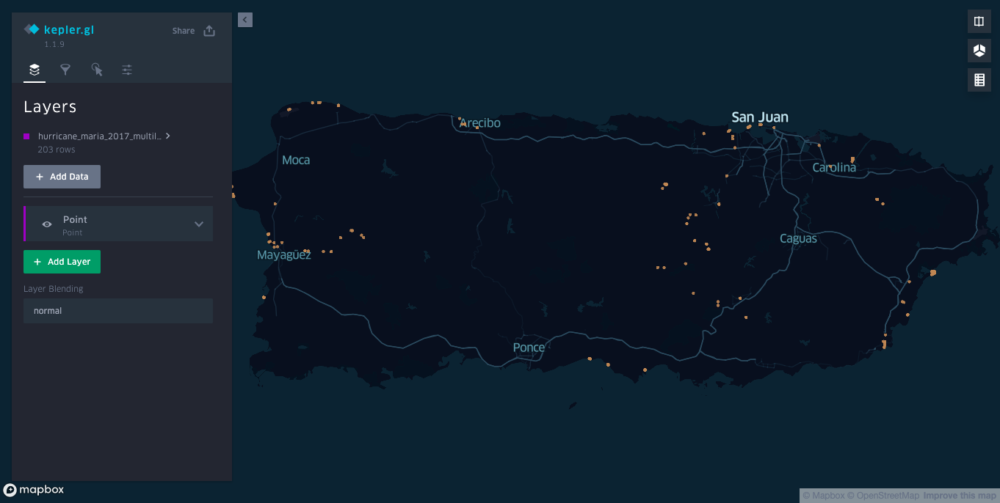
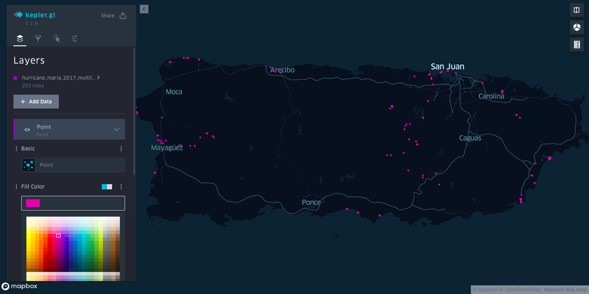
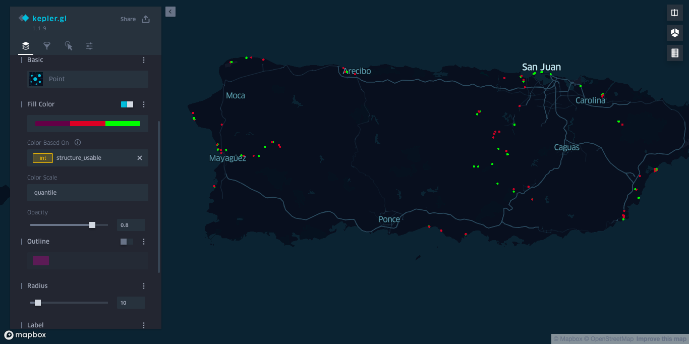

## Part 3: Visualize Data in Kepler

### Goal

Build and share two different custom interactive visualizations in Kepler from a single CSV dataset

### Requirements

Kepler works mainly on CSV data. For this lesson, we use [CSV data on violent incidents in Kivu](
https://github.com/OSU-Battelle-Center/DRC-Ebola-Conflict/blob/master/Data/kivu_security.csv) complied by the [Kivu Security Tracker](https://github.com/OSU-Battelle-Center/DRC-Ebola-Conflict/wiki/Dataset:-Violent-conflict-in-the-region)

### Instructions

Kepler.gl is a powerful and easy to use open source geospatial analysis tool for large-scale data sets. There is a link to open Kepler on the main page of Atlas, or directly at http://192.168.1.2:2999/kepler.gl

First, you will be prompted to upload data. Locate kivu_security.csv and upload.

#### Points visualization

Kepler will immediately to a simple Point visualization with the data set.

Open the "Points" visualization panel, and click the color box under "Fill Color", and select another color for the points.

Then click the box below "Color Based On", and select "Severity Rating". Kepler will apply a palette which increases brightness with the severity of the incident.

Next apply a filter. Click the "Filters" panel, then "+ Add Filter". Click "Select a field", and select "severity_rating". Adjust the range below to filter out low severity incidents.

Finally, adjust what fields are displayed when hovering over a point. Click the "Interactions" panel, and "x" off the "Latitude" and "Longitude" fields. Click elsewhere in the box and select "severity_rating", and "0/name".

#### Hexbin visualization

Before creating the second visualization, return to the "Filters" panel, and delete the filter.

Go back to the "Layers" panel, and under "Basic", click the visualization type dialog, and select "Hexbin". Also click the name of the Layer, and rename it from "Point" to "Hexbin". Hexbin will aggregate all points within a hexagonal tile.

Change the "Radius" to 10, and "x" out the "Color based on" selection so that it is "Point Count". The brighter the color, the more incidents occurred in that hexbin

To create a 3D view of the hexbins, select "3D Map" on the right side, and also "Show Legend". Enable "Height" in the "Layers" panel, and adjust "Elevation Scale" to 30.

#### Finalize and share the visualization

Add and recreate the original Points layer above, and then enable "Switch to dual map view". Select "Hexbin" in one and "Point" in another, to explore both views at once.

Click the "Base map" panel, and click "+ Add Map Style". In another tab, from the Share dialog of the Style editor, copy and paste the access token, and the style URL, into the "Add Custom Mapbox Style" dialog.

Finally Click "Share", then "Export Map". Make sure "json" is selected for the "Map format", then click "Export". This will trigger a download of "keplergl.json".

This file contains both the data and styling to recreate the visualization. You can share this json file with a colleague by email or flash disk, and they can upload to kepler to see your visualization.

To test this, reload your browser, and you will see the original "Add Data to Map" dialog. Find the json file you downloaded, and upload. Your visualization will be recreated entirely.

### Next step

[Part 4](./part-kit-admin.md)
