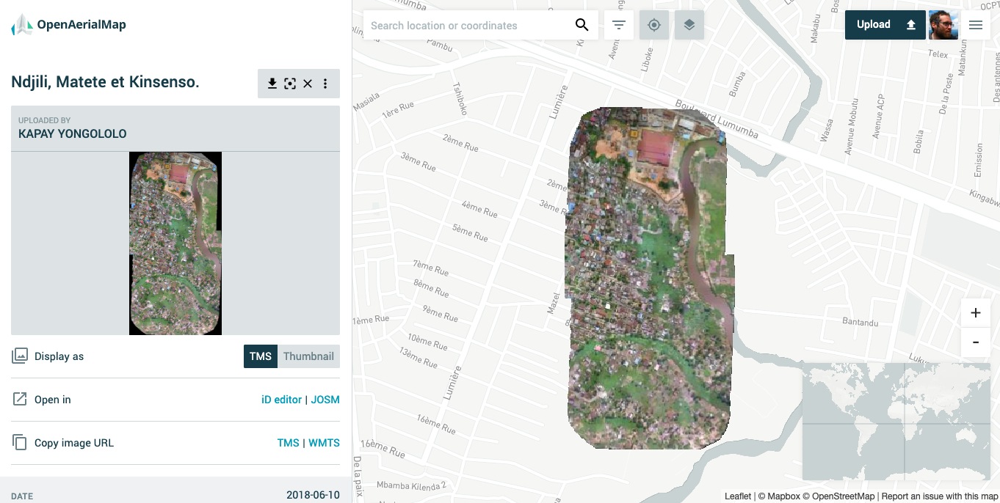

## Part 5: Process Imagery on Atlas

### Goal

Load and process imagery into a tileset on Atlas

### Requirements

An imagery file

<!-- to prepare, we'll put Kinshasa UAV GeoTIFF on device already. https://oin-hotosm.s3.amazonaws.com/5b1e6fd42b6a08001185f7bf/0/5b1e6fd42b6a08001185f7c0.tif -->

### Instructions

Find and download [Kinshasa UAV imagery from OpenAerialMap](https://map.openaerialmap.org/#/15.363425016403196,-4.3903893867821715,16/square/30001032111233/5b1e70942b6a08001185f7c1?_k=hofxke). This is a GeoTIFF file.

Then place that imagery on the Atlas Fly Away Kit.

`scp 5b1e6fd42b6a08001185f7c0.tif atlas@192.168.1.2:/tmp/`

To use the imagery in Atlas, the GeoTIFF needs to be processed into an mbtiles file. For that, we use [Rasterio](https://github.com/mapbox/rio-mbtiles)

`% rio mbtiles --src-nodata 0 --resampling bilinear --zoom-levels 13..20 -f PNG 5b1e6fd42b6a08001185f7c0.tif -o /tmp/5b1e6fd.mbtiles`

To briefly explain the configuration arguments we use for rio mbtiles
* `-f PNG`: The need to be PNG format because JPEG doesn't support transparency
* `--src-nodata 0` because the source file doesn't carry a nodata value. Otherwise a black box would surround the imagery
* `--resampling bilinear` this resampling method looks good and is fast enough

Finally, make the resulting mbtiles file accessible to Atlas.

`% cp /tmp/5b1e6fd.mbtiles ~/mbtiles/atlas-user.kinshasa-uav.mbtiles`

The format for any tileset in Atlas consists of the Atlas user name (`atlas-user`), the name of the tileset, and the ".mbtiles" suffix.

These tiles are now available as layers in any style on the Fly Away Kit.

### Next step

[Part 6](./part-process-vector.md)
