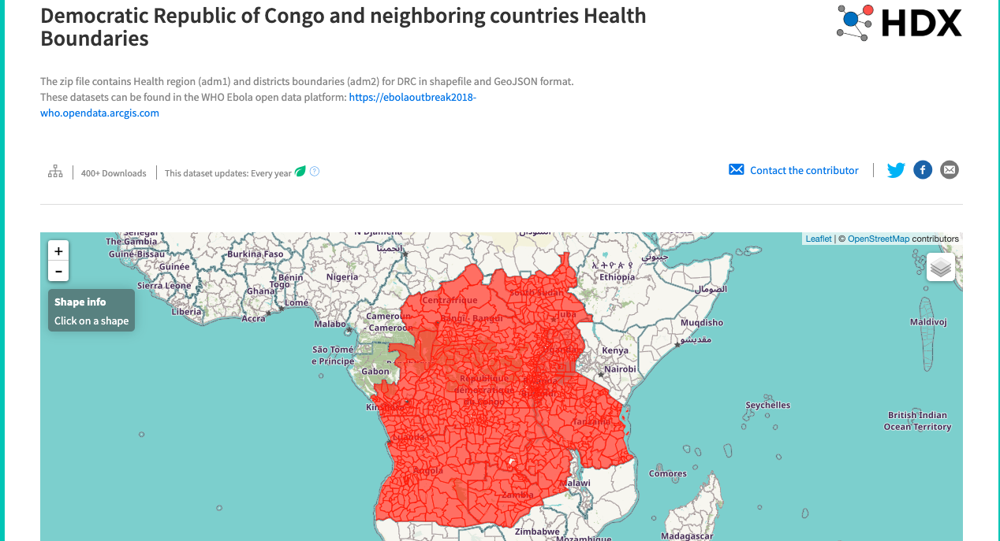

## Process Vector Data on Atlas

### Goal

Load and process a GeoJSON into a tileset

### Requirements

A GeoJSON file

<!-- to prepare, we'll put regional ADM2 boundaries on the Fly Away Kit. https://opendata.arcgis.com/datasets/815dfe56234044f6927ffb7b1b67dee3_1.geojson-->

### Instructions

- Find and download [Regional ADM2 boundaries](https://data.humdata.org/dataset/democratic-republic-of-congo-health-boundaries). (A zipped copy is available in this repository at [data/DRC_ADM2.zip](./data/DRC_ADM2.zip)). Once unzipped, this is a GeoJSON file.

- Copy your GeoJSON file onto the Atlas Fly Away Kit, renaming it to something that will identify it as yours. A temporary location is fine. For example:

  `scp DRC_ADM2.geojson atlas@192.168.1.2:/tmp/vakila-adm2.geojson`

- To use the data in Atlas, the GeoJSON needs to be processed into an `.mbtiles` file. For that, we use [Tippecanoe](https://github.com/mapbox/tippecanoe). There is a convenience script on the Fly Away Kit to run Tippecanoe on a GeoJSON file to convert it to mbtiles.

  Run the script `~/bin/geojson-to-tiles` by passing in the path to the GeoJSON file _without the `.geojson` extension_, for example:

  `~/bin/geojson-to-tiles /tmp/vakila-adm2`

  This will create an `.mbtiles` file with the same name and in the same directory as the GeoJSON (e.g. `/tmp/vakila-adm2.mbtiles`).

- To make the tileset available in Atlas, move the new `.mbtiles` file to the `atlas-server/mbtiles/` directory, and add the `atlas-user.` prefix to the filename. For example:

  `cp /tmp/vakila-adm2.mbtiles ~/mbtiles/atlas-user.vakila-adm2.mbtiles`

The new tileset can now be found on the Tilesets page at http://192.168.1.2:2999/studio/tilesets/ (you may need to refresh the page). This tileset is now available as a source in layers of any style on the Fly Away Kit.
